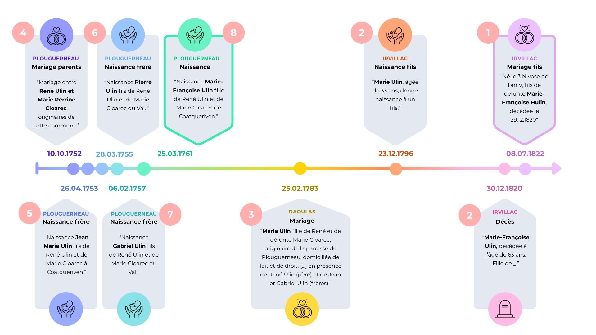

## 23.03.26 - La croisée des mondes!

Petite mise à jour du site mais avec quelques surprises en réserve!
Des ancêtres Renevot du Nord-Finistère? Un mystère résolu? Un ancêtre révolutionnaire? N'attendons plus!

#### ✨ Nouveautés

**Arbre généalogique**

-   Il manquait quelques informations du côté Renevot pour compléter les 6è (61. à 63.) et 7è générations (123. à 127.). C'est maintenant chose faite, avec une surprise donnant son nom à la mise à jour!

-   Une enquête ce mois-ci sur 65. (côté Pépé) dont l'acte de naissance restait introuvable et qui me permet de vous montrer une partie des coulisses. C'est à retrouver juste en dessous pour les plus curieux d'entre vous!

**Lieux**

-   La section sur Ploaré a été mise à jour. Avec 25 évènements (naissances, mariages et décès) familiaux célébrés, c'est LE haut-lieu de la famille côté Renevot!

#### 🔍 Enquête

Tout commence avec l'acte de mariage de 32. Jean Marie Le Berre...

- 08.07.1822: 32. Jean-Marie Le Berre se marie à Irvillac. L'acte stipule notamment que le jeune homme de 25 ans, né le 3 nivose de l'an V, est le fils des défunts Corentin Le Berre et Marie Françoise Hulin, cette dernière décédée le 29.12.1820. 

Pas très dur, donc, de retrouver i) l'acte de naissance  de 32. mais aussi ii) l'acte de décès de celle dont on a maintenant le nom: **65. Marie Françoise Hulin**!

- 23.12.1796: l'acte de naissance de 32. Jean-Marie Le Berre est rédigé. Né à Irvillac le jour précédent, il a pour parents Corentin Le Berre âgé de 40 ans et Marie Ulin alors âgée de 33 ans.

- 30.12.1820: l'acte de décès de Marie Françoise Ulin est dressé à Irvillac. Il est écrit qu'elle est décédée à l'âge de 63 ans, qu'elle est née à Irvillac mais ses parents sont inconnus.

On récupère deux informations clés, son **lieu de naissance - Irvillac** et son année de **naissance approximative - entre 1757 (selon l'acte son acte de décès) et 1763 (selon l'acte de naissance de son fils)**. Bonus, on sait maintenant que son prénom peut-être **Marie ou Marie-Françoise** et son nom **Hulin ou Ulin**. Jusque là, un succès!

Mais en épluchant les actes de naissances d'Irvillac de 1755 à 1765, rien. Pas de Marie-Françoise Ulin, pas de Marie  Hulin, d'ailleurs pas de Hulin, ni de Ulin tout court. 

Face à l'impasse, je me penche sur son acte de mariage. Pas non plus sur Irvillac, mais coup de chance, à Daoulas!

- 25.02.1783: 64. Corentin Le Berre se marie avec 65. Marie Ulin, fille de René Ulin et de défunte Marie Cloarec... originaire de la paroisse de Plouguerneau! 

Bingo! On obtient les noms de ses parents **René Ulin et Marie Cloarec**, mais surtout, on a sa véritable ville d'origine: **Plouguerneau**. Il faut croire qu'au moment de son décès, plus personne n'était là pour se rappeler d'où elle venait. Je me dirige donc vers les tables décennales[^1].

A partir de là, tout s'enchaine: je retrouve l'acte de mariage de ses parents fin 1752, l'acte de naissance de ses frères ainés Jean (présent à son mariage), né en 1753, Pierre, né en 1755, et Gabriel (présent à son mariage), né en 1757. Puis les années passent et... trouvé! 1761, naissance de Marie-Françoise Ulin, 7è feuillet, verso. 

[^1]: Document rédigé en général sous forme de tableau ou de liste répertoriant par ordre alphabétique les naissances, mariages et décès d'une paroisse/ville sur l'année ou après la révolution française sur la décennie. Très pratique lorsque la date de naissance est incertaine!

:::  {.column-page}

:::

Bref, on remonte le temps, parfois on revient sur nos pas. On ne sait plus quel acte croire et même parfois quel information croire. Mais quelle satisfaction de trouver!

En espérant que ce petit récit vous aura plû, on se retrouve le mois prochain pour une nouvelle mise à jour avec certainement son lot de surprises! 

## 08.03.26 - Mise en ligne du site 

Le site est désormais en ligne ! 🎉\
Cette première version est loin d'être parfaite, mais elle permet déjà d’explorer notre arbre généalogique.

#### ✨ Nouveautés

**Arbre généalogique accessible**

-   Consultation des **dates de naissance, de mariage et de décès** de nos ancêtres jusqu’à **7 générations**.

-   Accès aux **noms de la 8ᵉ génération**.

**Navigation familiale**

-   Possibilité de parcourir les différentes branches de la famille avec le plan de page à droite et de remonter une lignée via le lien hypertexte sur les parents.

#### 🚧 En développement

**Page “Lieux”**

-   La section existe déjà mais est **encore vide pour le moment**. Elle sera enrichie plus tard avec pour présenter les lieux et lieux-dits dont sont originaires nos ancêtres avec des statistiques, anecdotes, etc.

#### 🔧 Notes

-   Le site vient tout juste d’être mis en ligne : certaines fonctionnalités pourront (et vont!) encore évoluer.

-   N’hésitez pas à signaler **erreurs, informations manquantes ou suggestions** pour améliorer l’arbre généalogique.

Merci à tous, j'espère que le site vous plaira !
