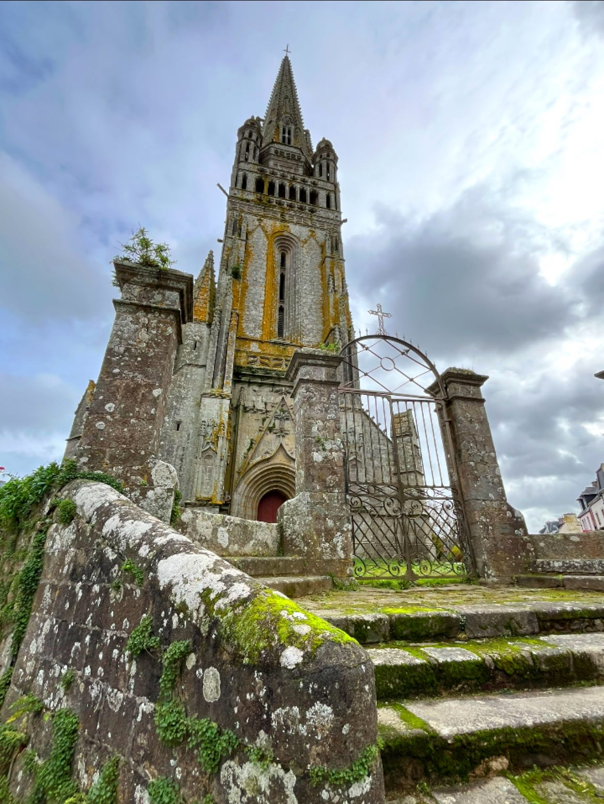
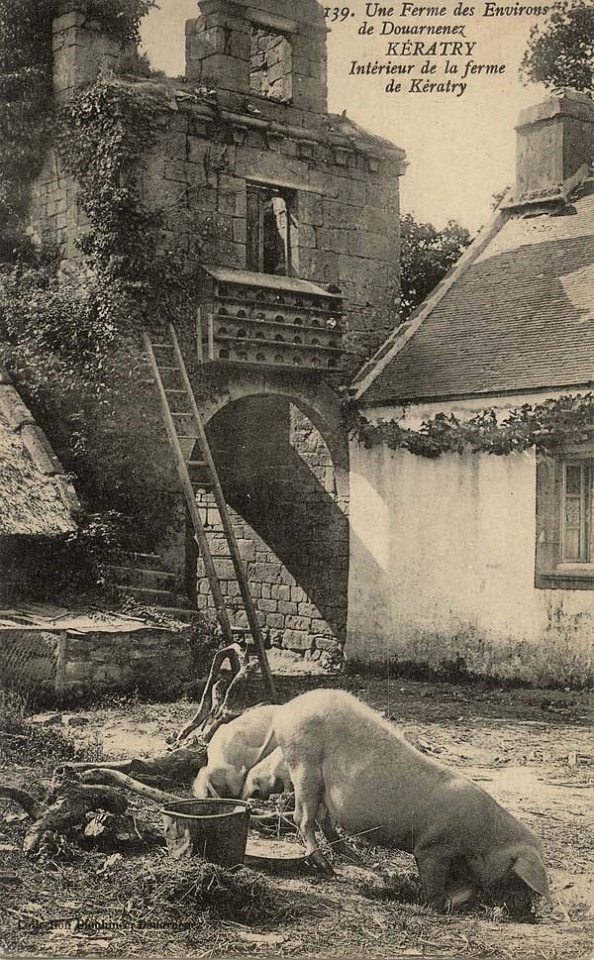

## Braspart 

::: callout-warning
## Work in progress

Oups... Je n'ai pas encore eu le temps de me pencher sur cette partie pour l'instant, ça viendra sûrement bientôt!

N'hésitez pas à m'envoyer toutes vos anecdotes par mail: sarah.leberre\@yahoo.com
:::

## Cast

::: callout-warning
## Work in progress

Oups... Je n'ai pas encore eu le temps de me pencher sur cette partie pour l'instant, ça viendra sûrement bientôt!

N'hésitez pas à m'envoyer toutes vos anecdotes par mail: sarah.leberre\@yahoo.com
:::

## Daoulas

::: callout-warning
## Work in progress

Oups... Je n'ai pas encore eu le temps de me pencher sur cette partie pour l'instant, ça viendra sûrement bientôt!

N'hésitez pas à m'envoyer toutes vos anecdotes par mail: sarah.leberre\@yahoo.com
:::

## Guengat

::: callout-warning
## Work in progress

Oups... Je n'ai pas encore eu le temps de me pencher sur cette partie pour l'instant, ça viendra sûrement bientôt!

N'hésitez pas à m'envoyer toutes vos anecdotes par mail: sarah.leberre\@yahoo.com
:::

## Hanvec

::: callout-warning
## Work in progress

Oups... Je n'ai pas encore eu le temps de me pencher sur cette partie pour l'instant, ça viendra sûrement bientôt!

N'hésitez pas à m'envoyer toutes vos anecdotes par mail: sarah.leberre\@yahoo.com
:::

## Irvillac

::: callout-warning
## Work in progress

Oups... Je n'ai pas encore eu le temps de me pencher sur cette partie pour l'instant, ça viendra sûrement bientôt!

N'hésitez pas à m'envoyer toutes vos anecdotes par mail: sarah.leberre\@yahoo.com
:::

## Landerneau

::: callout-warning
## Work in progress

Oups... Je n'ai pas encore eu le temps de me pencher sur cette partie pour l'instant, ça viendra sûrement bientôt!

N'hésitez pas à m'envoyer toutes vos anecdotes par mail: sarah.leberre\@yahoo.com
:::

## La Rouxière

::: callout-warning
## Work in progress

Oups... Je n'ai pas encore eu le temps de me pencher sur cette partie pour l'instant, ça viendra sûrement bientôt!

N'hésitez pas à m'envoyer toutes vos anecdotes par mail: sarah.leberre\@yahoo.com
:::

## Le Tréhou

::: callout-warning
## Work in progress

Oups... Je n'ai pas encore eu le temps de me pencher sur cette partie pour l'instant, ça viendra sûrement bientôt!

N'hésitez pas à m'envoyer toutes vos anecdotes par mail: sarah.leberre\@yahoo.com
:::

## L'Hôpital-Camfrout

::: callout-warning
## Work in progress

Oups... Je n'ai pas encore eu le temps de me pencher sur cette partie pour l'instant, ça viendra sûrement bientôt!

N'hésitez pas à m'envoyer toutes vos anecdotes par mail: sarah.leberre\@yahoo.com
:::

## Logonna-Daoulas 

::: callout-warning
## Work in progress

Oups... Je n'ai pas encore eu le temps de me pencher sur cette partie pour l'instant, ça viendra sûrement bientôt!

N'hésitez pas à m'envoyer toutes vos anecdotes par mail: sarah.leberre\@yahoo.com
:::

## Lopérec

::: callout-warning
## Work in progress

Oups... Je n'ai pas encore eu le temps de me pencher sur cette partie pour l'instant, ça viendra sûrement bientôt!

N'hésitez pas à m'envoyer toutes vos anecdotes par mail: sarah.leberre\@yahoo.com
:::

## Minihy-du-Léon

Ancien territoire, morcelé suite à la révolution française afin d'alimenter les communes de Roscoff, Santec et Saint-Pol-de-Léon.

::: callout-warning
## Work in progress

Oups... Je n'ai pas encore eu le temps de me pencher sur cette partie pour l'instant, ça viendra sûrement bientôt!

N'hésitez pas à m'envoyer toutes vos anecdotes par mail: sarah.leberre\@yahoo.com
:::

## Pleyben 

::: callout-warning
## Work in progress

Oups... Je n'ai pas encore eu le temps de me pencher sur cette partie pour l'instant, ça viendra sûrement bientôt!

N'hésitez pas à m'envoyer toutes vos anecdotes par mail: sarah.leberre\@yahoo.com
:::
## Ploaré

Ploaré est une paroisse puis un village, fusionné avec Douarnenez en 1945.

Le nom Ploaré est dérivé du préfixe **"Plou-"**, qui signifie *paroisse* et de "*Herlé*", en référence à Saint-Herlé, un saint breton local et ancien (Vè ou VIè siècle) appartenant probablement à un **groupe de saints missionaires venus de Grande-Bretagne**. La position géographique de Ploaré est typique des villages de cette époque: situé sur un plateau et en retrait d'environ 500m par rapport à l'océan, c'est une position stratégique au Vè-VIè siècle pour éviter les raids de pirates anglo-saxons ou vikings. On peut donc penser que Saint-Herlé est le fondateur de la paroisse.

Ploaré est donc un village mais avant tout une paroisse très ancienne, avec des origines profondément chrétiennes. Pendant longtemps son influence était étendue sur un large territoire dont Douarnenez, Le Juch et Gourlizon étaient des trèves, respectivement jusqu'en 1875, 1844 et 1879.

:::::: columns
:::: {.column width="40%"}

::::

:::: {.column width="5%"}
::::

:::: {.column width="55%"}
Le batîment le plus important du quartier est son église dont la construction a débutée en 1548 par-dessus les vestiges d'une église romane. L'église Saint-Herlé est encore aujourd'hui considérée comme la plus belle église du pays de Douarnenez, et figure parmi le top 10 des plus belles églises du Finistère notamment grâce à son clocher gothique-cornouaillais, l'un des plus hauts de Cornouaille. Fait original: l'église comporte 103 trous au sein de la nef et du coeur afin d'améliorer l'accoustique. L'église a par la suite subit des travaux de rénovation et des agrandissement suite au nombre croissant de paroissiens.
::::
::::::

Les écrits de Jules Breton (1827-1906), artiste et écrivain voyageant en Bretagne en 1865 et de passage à Ploaré, attestent par ailleurs de ce fait:

:::::: colmuns

:::: {.column width="30%"}

::: text-center
*"Quoique grande, l'église est trop petite; les fidèles qu'elle ne peut contenir s'agenouillent sous le porche, sous les arbres ou le long des saintes murailles où des fanatiques, les bras en croix, se collent comme des bas-reliefs, tandis que d'autres se prosternent, le front au granit, le chapelet aux doigts [...]. Les moins pieux s'asseoient sur le mur d'enceinte."*
:::

::::

:::: {.column width="5%"}
::::

:::: {.column width="60%"}

::::

::::::

Jules Breton produit aussi une description du pays dans son livre "La vie d'un artiste: Art et nature":

::: text-center
*"Ploaré est un assez important village qui continue Douarnenez sur la hauteur; le long de la route de Quimper. Le pays y est superbe: des bois de pins maritimes très hauts, mêlés de hêtres, où bondissent les écureuils; de chênes très tourmentés, de châtaigniers dont quelques-uns énormes, de blancs de Hollande et de cognassiers; avec ça et là quelque ferme de granit au toit de chaume, noyée dans son fumier; puis des landes aux bruyères roses, aux ajoncs d'or; un vallon d'une gaité sauvage, son petit ruisseau et son moulin perdus dans mille broussailles fleuries; plus loin des prairies, des seigles, des sarrasins neigeux; de magnifiques allées toujours ombreuses que traversent des troupeaux de petites vaches et de porcs majestueux; où enfin cheminent les jours de marché, de nombreux groupes de paysans dont souvent la marche décrit de capricieux festons."*
:::

Comme le laisse penser cette dernière phrase, sa description des habitants est un peu moins élogieuse... Il décrit plus loin des fidèles le dimanche matin *"étendus dans l'herbe, la tête sur leur chapeau en guise d'oreiller, cuvant leur libations trop matinales"*, s'attarde sur un *"paysan ivre"*, somnolant et tombant en arrière lors de la messe. Quant aux femmes, il ne mâche pas ses mots, elles seraient *"laides, lourdes et mal tournées"*, sans parler de celles qu'il qualifie de vulgaire. Il mentionne des *"difformités, parfois extraordinairement étranges"*, des soeurs ayant *"l'air de bêtes apocalyptiques dont l'horreur et la monstruosité fascinante"* l'obsèdent. (Je nous épargne une génération d'image par IA)

Lors de la révolution française, la paroisse de Ploaré (trèves comprises) comprennent 360 feux (comprendre là, foyer fiscaux) et élisent 4 délégués: François Le Menn (de Kerstrat), Jean Le Castrec (du Cosquer), Jean Le Coeur (de Gourlizon) et **Jean Hémon (de Kermenguy)**. Ces délégués représentèrent leurs intérêts à l'assemblée du tiers-état de Quimper au Printemps 1789. Ces doléances demandent notamment que la religion catholique soit la seule observée en France, que les corvées (entendre travail non-rémunéré pour l'état) soient abolies, ou encore que l'alcool (vin, eau de vie et autres liqueurs) soit distribué au même prix à tous.

::: callout-note
Jean Hémon de Kermenguy n'est pas un ancêtre direct mais très certainement un membre de la famille côté Renevot. Probablement le frère de **228. Jacques Hémon**, né en 1750 et décédé en 1811.
:::

##### Quelques personnages importants

:::: columns

::: {.column width="45%"}

:::

::: {.column width="5%"}
:::

::: {.column width="50%"}
- Les **de Keratry** étaient une famille noble de Ploaré dont les traces les plus anciennes remontent à 1475, et dont les générations se sont succédées en maintenant une influence politique. On peut citer François de Keratry, né au Juch en 1640, seigneur de Keratry ainsi que son fils ayant eu le même titre. Le fils de ce dernier fût président élu de la noblesse aux Etats de Bretagne en 1766. Son fils fût député du Finistère et pair de France et le fils de ce dernier fut aussi député du Finistère. Ils possédaient notamment un manoir dont il ne subsistait plus que la porte en 1930. 

- **Joseph Villard** (1838-1898) est un photographe et éditeur de cartes postales né à Ploaré. Il ouvre l'un des premiers ateliers de photographie de Quimper et publie de nombreuses photos des costumes et paysages bretons. 
:::
::::

- **René Laennec** (1781-1826) est un médecin, créateur du diagnostic médical par auscultation et inventeur du stéthoscope originaire de Quimper et décédé à Ploaré en son manoir de Kerlouarnec. A sa mort le manoir est récupéré par la famille du Fretay.

- Les **du Fretay** sont une famille ayant occupé le poste de maire de pères en fils au cours du XIXè siècle. De 1808 à 1945, ils occupent la position sur un total cumulé de 122 ans.

- **Corentin Celton** (1901-1943), né à Ploaré, était un syndicaliste dans le milieu hospitalier, résistant communiste pendant la Seconde Guerre mondiale. Incarcéré dans les prisons de Clairvaux, puis de Fresnes, il fut fusillé le 29 décembre 1943 au Mont Valérien. Son nom a été donné à un hôpital parisien ainsi qu'à une station de métro.

##### Quelques chiffres

- 4013 habitants en 1936

## Plogonnec 

::: callout-warning
## Work in progress

Oups... Je n'ai pas encore eu le temps de me pencher sur cette partie pour l'instant, ça viendra sûrement bientôt!

N'hésitez pas à m'envoyer toutes vos anecdotes par mail: sarah.leberre\@yahoo.com
:::

## Plomodiern

::: callout-warning
## Work in progress

Oups... Je n'ai pas encore eu le temps de me pencher sur cette partie pour l'instant, ça viendra sûrement bientôt!

N'hésitez pas à m'envoyer toutes vos anecdotes par mail: sarah.leberre\@yahoo.com
:::

## Ploudiry

::: callout-warning
## Work in progress

Oups... Je n'ai pas encore eu le temps de me pencher sur cette partie pour l'instant, ça viendra sûrement bientôt!

N'hésitez pas à m'envoyer toutes vos anecdotes par mail: sarah.leberre\@yahoo.com
:::

## Plougastel-Daoulas

Plougastel est particulière dans le sens où c'est la seule ville avec Plounevez Lochrist à ne pas porter le nom d'un saint derrière son plou. 

## Pont-de-Buis-lès-Quimerc'h

Commune créée en 1965 de la fusion des anciennes communes de Logonna-Quimerc'h, Quimerc'h et Pont-de-Buis.

## Pouldergat

::: callout-warning
## Work in progress

Oups... Je n'ai pas encore eu le temps de me pencher sur cette partie pour l'instant, ça viendra sûrement bientôt!

N'hésitez pas à m'envoyer toutes vos anecdotes par mail: sarah.leberre\@yahoo.com
:::

::: callout-warning
## Work in progress

Oups... Je n'ai pas encore eu le temps de me pencher sur cette partie pour l'instant, ça viendra sûrement bientôt!

N'hésitez pas à m'envoyer toutes vos anecdotes par mail: sarah.leberre\@yahoo.com
:::

## Quéménéven

::: callout-warning
## Work in progress

Oups... Je n'ai pas encore eu le temps de me pencher sur cette partie pour l'instant, ça viendra sûrement bientôt!

N'hésitez pas à m'envoyer toutes vos anecdotes par mail: sarah.leberre\@yahoo.com
:::

## Roscoff

::: callout-warning
## Work in progress

Oups... Je n'ai pas encore eu le temps de me pencher sur cette partie pour l'instant, ça viendra sûrement bientôt!

N'hésitez pas à m'envoyer toutes vos anecdotes par mail: sarah.leberre\@yahoo.com
:::

## Rosnoën 

::: callout-warning
## Work in progress

Oups... Je n'ai pas encore eu le temps de me pencher sur cette partie pour l'instant, ça viendra sûrement bientôt!

N'hésitez pas à m'envoyer toutes vos anecdotes par mail: sarah.leberre\@yahoo.com
:::

## Rumengol

::: callout-warning
## Work in progress

Oups... Je n'ai pas encore eu le temps de me pencher sur cette partie pour l'instant, ça viendra sûrement bientôt!

N'hésitez pas à m'envoyer toutes vos anecdotes par mail: sarah.leberre\@yahoo.com
:::

## Saint-Eloy

::: callout-warning
## Work in progress

Oups... Je n'ai pas encore eu le temps de me pencher sur cette partie pour l'instant, ça viendra sûrement bientôt!

N'hésitez pas à m'envoyer toutes vos anecdotes par mail: sarah.leberre\@yahoo.com
:::

## Saint-Herblon

::: callout-warning
## Work in progress

Oups... Je n'ai pas encore eu le temps de me pencher sur cette partie pour l'instant, ça viendra sûrement bientôt!

N'hésitez pas à m'envoyer toutes vos anecdotes par mail: sarah.leberre\@yahoo.com
:::

## Saint-Pierre-des-Corps

::: callout-warning
## Work in progress

Oups... Je n'ai pas encore eu le temps de me pencher sur cette partie pour l'instant, ça viendra sûrement bientôt!

N'hésitez pas à m'envoyer toutes vos anecdotes par mail: sarah.leberre\@yahoo.com
:::

## Saint-Urbain

::: callout-warning
## Work in progress

Oups... Je n'ai pas encore eu le temps de me pencher sur cette partie pour l'instant, ça viendra sûrement bientôt!

N'hésitez pas à m'envoyer toutes vos anecdotes par mail: sarah.leberre\@yahoo.com
:::

## Sizun

::: callout-warning
## Work in progress

Oups... Je n'ai pas encore eu le temps de me pencher sur cette partie pour l'instant, ça viendra sûrement bientôt!

N'hésitez pas à m'envoyer toutes vos anecdotes par mail: sarah.leberre\@yahoo.com
:::

## Varades

::: callout-warning
## Work in progress

Oups... Je n'ai pas encore eu le temps de me pencher sur cette partie pour l'instant, ça viendra sûrement bientôt!

N'hésitez pas à m'envoyer toutes vos anecdotes par mail: sarah.leberre\@yahoo.com
:::